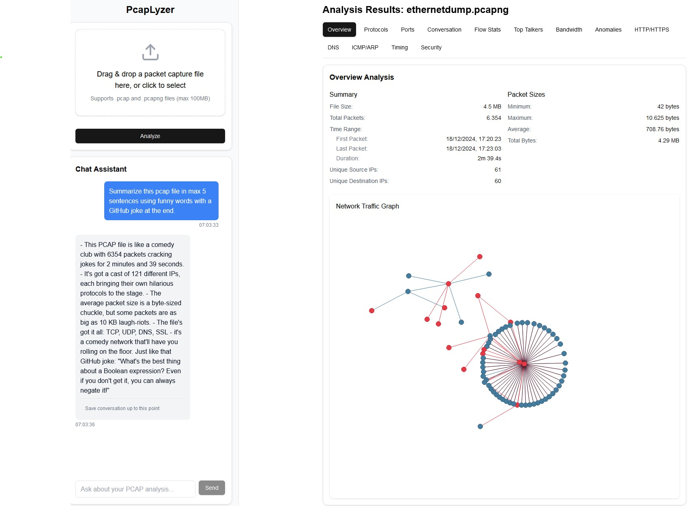

# pcapLyzer

A modern web application for analyzing network packet capture (PCAP) files with AI-powered insights and interactive network visualization.



## Features

- 📊 Interactive network traffic visualization
- 🤖 AI-powered packet analysis using OpenAI and Gemini
- 📁 Drag-and-drop PCAP file upload
- 🔍 Detailed packet inspection and analysis
- 📈 Network graph visualization
- 📝 Save chat conversations in `.md` format for improved readability and compatibility with Markdown-supported tools.

## Tech Stack

### Frontend
- **Framework**: Next.js 14, React, TypeScript
- **UI Components**: shadcn/ui
- **Styling**: Tailwind CSS
- **Charts**: Chart.js with react-chartjs-2
- **File Handling**: react-dropzone
- **Icons**: Lucide React

### Backend
- **Server**: Next.js API Routes
- **Packet Analysis**: Wireshark/tshark, Python
- **AI Integration**: OpenAI API or Google Gemini API (Google offers a free tier for the Gemini API, allowing developers to test and explore its capabilities without incurring costs)

## Prerequisites

### System Requirements
- Wireshark/TShark (v4.4.2 or higher)
  - Windows: Download and install from [Wireshark's official website](https://www.wireshark.org/download.html)
  - macOS: `brew install wireshark`
  - Linux: `sudo apt-get install wireshark tshark`
  - Verify installation: `tshark --version`

### Other Requirements
- Node.js 18.x or higher
- Python 3.8 or higher
- OpenAI API key
- Google Gemini API key


## Installation

1. Clone the repository:
```bash
git clone https://github.com/ZoR420/pcapLyzer.git
cd pcapLyzer
```

2. Install Node.js dependencies:
```bash
npm install
```

3. Install Python dependencies:
```bash
pip install -r requirements.txt
```

4. Set up environment variables:
```bash
cp .env.example .env
```
Fill in your API keys and configuration in the `.env` file.

## Development

Run the development server:

```bash
npm run dev
```

Open [http://localhost:3000](http://localhost:3000) with your browser to see the result.

## Environment Variables

Create a `.env` file with the following variables:

```
OPENAI_API_KEY=your_openai_api_key
NEXT_PUBLIC_GEMINI_API_KEY=your_gemini_api_key
NODE_ENV=development
DEBUG=true
```

## License

This project is licensed under the MIT License - see the [LICENSE](LICENSE) file for details.

## Contributing

Contributions are welcome! Please feel free to submit a Pull Request.

## Security

Please do not commit any API keys or sensitive information. Use environment variables for all sensitive data.
